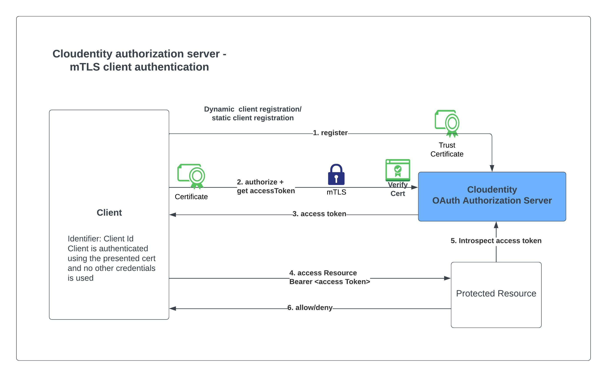
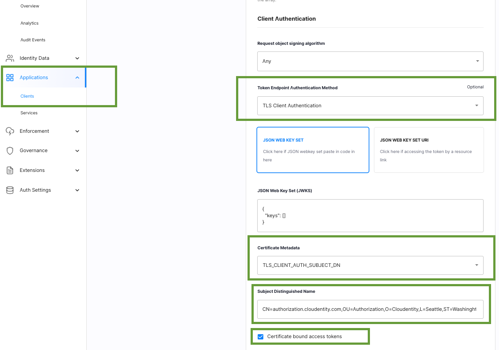

# OAuth mTLS client authentication using Cloudentity

Cloudentity authorization platform provides implementation of [RFC8705 -OAuth 2.0 Mutual-TLS Client Authentication and Certificate-Bound Access Tokens](https://datatracker.ietf.org/doc/html/rfc8705) for OAuth client authentication using mutual TLS, based on either self-signed certificates or public key infrastructure (PKI). 

Cloudentity authorization server also allows binding access tokens to the client's mutual-TLS certificate that can be used to further secure protected resource access using the access tokens.


 
Let's talk a look at the high level steps required to enable OAuth mtlS support for your application with  Cloudentity authorization server.

* Register an OAuth client application in Cloudentity OAuth authorization server
  * Provide the certificate verification criteria that would be used to convey the expected subject of the certificate
  * Set the client authentication type as `self_signed_tls_client_auth` or `tls_client_auth`
* Now that the client is configured
   * Make an authorize call to get authorization code(applicable only for code grant flow)
   * Call the mtlS token endpoint in Cloudentity OAuth authorization server
      * Here the certificate presented during TLS handshake should match one of the criteria provided during registration step. If not, the authorization server will reject the access token request
* Client can use the issued access token to call protected resources.

Cloudentity exposes the required metadata in well known endpoint to showcase the supported endpoints,
authentication methods and other parameters as required in the specification.

```json
..
"token_endpoint_auth_methods_supported":[.."self_signed_tls_client_auth","tls_client_auth"..],
"tls_client_certificate_bound_access_tokens":true,
"mtls_endpoint_aliases": {
	"token_endpoint": "https://rtest.mtls.us.authz.cloudentity.io/rtest/pyron-mtls-auth-server/oauth2/token",
	"revocation_endpoint": "https://rtest.mtls.us.authz.cloudentity.io/rtest/pyron-mtls-auth-server/oauth2/revoke",
	"introspection_endpoint": "https://rtest.mtls.us.authz.cloudentity.io/rtest/pyron-mtls-auth-server/oauth2/introspect"
}, 
"mtls_issuer": "https://rtest.mtls.us.authz.cloudentity.io/rtest/pyron-mtls-auth-server",
..
```

As you can see above, Cloudentity offers dedicated endpoint for mTLS endpoints. This approach allows to have an ecosystem of mTLS protected client applications and regular client applications based on security requirements.

Below is a sample client application configuration configured for TLS Client authentication that would be matched by looking at the `Subject DN` in the handshaked certificate.



### How to quickly see this in action?

Let's see this in action with some quick demonstrations

1. [Register for a free Cloudentity SaaS tenant, iff you have not already done it](https://authz.cloudentity.io/register)
   * Activate the tenant and take the self guided tour to familiarize with the platform
2. Create an OAuth client application and configure mTLS criteria
   * Choose the application type as `service`, which will configure the grant type as `client_credentials`. We are choosing this as its easy to demonstrate and skips the authorize flow. 
   We have provided some sample application code snippets in other articles attached below that goes through more complex flows.
   * Set the authentication type
   * Configure jwks_uri or json web key set(for self signed tls authentication)
   * Configure certificate metadata matching criteria from one of the below
      * subject DN
      * DNS SAN
      * ipAddress SAN
      * email SAN
3. Fetch an accessToken using client credentials flow
   While mTLS is great for security, it can be quite overwhelming to use common debugging and testing techniques, but we have attached couple of ways to test this out

#### Fetch access tokens 

Let's use `curl` to test this out quickly

```bash
curl  --cacert ca.crt \
      --key client.key \
      --cert client.crt \
      --header 'Content-Type: application/x-www-form-urlencoded' \
      --data-urlencode 'grant_type=client_credentials' \
      --data-urlencode 'client_id=c7tiikbj5qe7son8dd5g' \
      --request POST \
      -k \
      'https://rtest.mtls.us.authz.cloudentity.io/rtest/pyron-mtls-auth-server/oauth2/token' 
```

Sample output

```json
{
	"access_token": "eyJhbGciOiJFUzI1NiIsImtpZCI6I...",
	"expires_in": 3599,
	"scope": "introspect_tokens revoke_client_access revoke_tokens",
	"token_type": "bearer"
}
```

### Further reading & examples

[Read the Cloudentity product guide explaining more concepts and details](https://docs.authorization.cloudentity.com/features/oauth/client_auth/tls_client_auth/)

We have more sample applications built to demonstrate the mTLS capability for various use cases in
different languages. Check out our developer articles for these here

* Secured API in NodeJS protected using Cloudentity certificate bound accessToken
* AWS API Gateway resource protected using Cloudentity certificate bound accessToken

Check it out for yourself using our FREE tenant. You'll find helpful product documentation here or contact us and we'd be happy to answer any questions and give you a demo.


