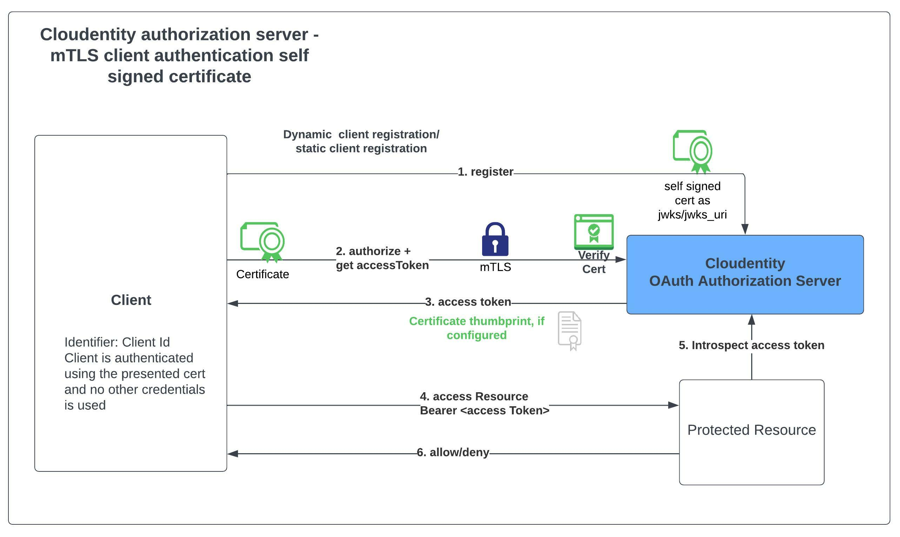
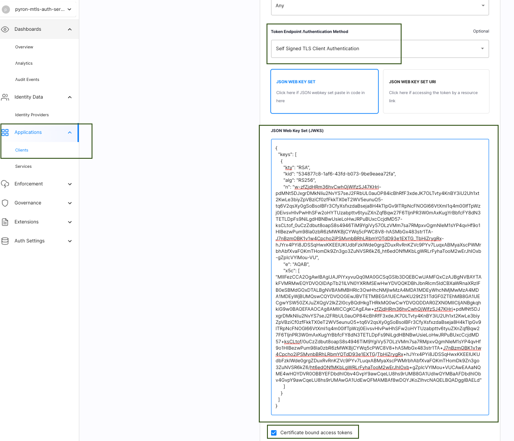

# OAuth mTLS client authentication with self signed certificate

Cloudentity authorization platform provides implementation for [RFC-8705 -OAuth 2.0 Mutual-TLS Client Authentication and Certificate-Bound Access Tokens](https://datatracker.ietf.org/doc/html/rfc8705) - OAuth client authentication using mutual TLS, based on either self-signed certificates or public key infrastructure (PKI). 

Cloudentity authorization server also allows binding access tokens([certificate bound access token](https://datatracker.ietf.org/doc/html/rfc8705#section-3)) to the client's mutual-TLS certificate that can be used to further secure protected resource access using the access tokens. In this article, we will be specifically looking at how to setup and configure an OAuth client to authenticate with tls authentication mechanism using self signed certificate and obtain a certificate bound access token. This OAuth client configuration has minor deviations compared to the regular tls authentication mechanism for the OAuth client [as defined in the specification.](https://datatracker.ietf.org/doc/html/rfc8705#section-2.2)

> *In contrast to the PKI method, the client's certificate
   chain is not validated by the server in this case.  The client is
   successfully authenticated if the certificate that it presented
   during the handshake matches one of the certificates configured or
   registered for that particular client.  The Self-Signed Certificate
   method allows the use of mutual TLS to authenticate clients without
   the need to maintain a PKI.  When used in conjunction with a
   "jwks_uri" for the client, it also allows the client to rotate its
   X.509 certificates without the need to change its respective
   authentication data directly with the authorization server.*




Cloudentity exposes the required metadata in well known endpoint to showcase the supported endpoints,
authentication methods and other parameters as required in the specification.

```json
..
"token_endpoint_auth_methods_supported":[.."self_signed_tls_client_auth","tls_client_auth"..],
"tls_client_certificate_bound_access_tokens":true,
"mtls_endpoint_aliases": {
	"token_endpoint": "https://rtest.mtls.us.authz.cloudentity.io/rtest/pyron-mtls-auth-server/oauth2/token",
	"revocation_endpoint": "https://rtest.mtls.us.authz.cloudentity.io/rtest/pyron-mtls-auth-server/oauth2/revoke",
	"introspection_endpoint": "https://rtest.mtls.us.authz.cloudentity.io/rtest/pyron-mtls-auth-server/oauth2/introspect"
}, 
"mtls_issuer": "https://rtest.mtls.us.authz.cloudentity.io/rtest/pyron-mtls-auth-server",
..
```

As you can see above, Cloudentity offers dedicated endpoint for mTLS endpoints. This approach allows to have an ecosystem of mTLS protected client applications and regular client applications based on varying security requirements.

Below is a sample OAuth client application configured for Self Signed Certificate based TLS Client authentication that would be matched by comparing the certificate presented during TLS handshake with the certificate configured in the [`JSON Web Key Set`](https://datatracker.ietf.org/doc/html/rfc7517) or [`JSON Web Key Set URI`](https://datatracker.ietf.org/doc/html/rfc7517).



### How to quickly see this in action?

Let's see this in action with some quick demonstrations

1. [Register for a free Cloudentity SaaS tenant, if you have not already done it](https://authz.cloudentity.io/register)
   * Activate the tenant and take the self guided tour to familiarize with the platform
2. [Create a self signed certificate](https://renjith85.medium.com/generate-self-signed-certificates-with-san-using-openssl-99e73ee5e164) that will be used to establish communication between OAuth client application, Cloudentity authorization server and resource server. Once you have an RSA key pair, use the public key to generate the JWKS that includes the `alg` and `x5c`.

> NOTE: In case you want to use one of the existing cert/key pairs, use the follwing artificats
* [client.cert](https://github.com/cloudentity/ce-samples-mtls-demo/blob/master/sample-nodejs-mtls-oauth-client/client.cert)
* [client.key](https://github.com/cloudentity/ce-samples-mtls-demo/blob/master/sample-nodejs-mtls-oauth-client/client.key)

For below sample RSA Public key in pem format

```bash
-----BEGIN CERTIFICATE-----
MIIFezCCA2OgAwIBAgIJAJPiYxyvuQq0MA0GCSqGSIb3DQEBCwUAMFQxCzAJBgNV
BAYTAkFVMRMwEQYDVQQIDApTb21lLVN0YXRlMSEwHwYDVQQKDBhJbnRlcm5ldCBX
aWRnaXRzIFB0eSBMdGQxDTALBgNVBAMMBHRlc3QwHhcNMjIwMzA4MDA1MDEyWhcN
MjMwMzA4MDA1MDEyWjBUMQswCQYDVQQGEwJBVTETMBEGA1UECAwKU29tZS1TdGF0
ZTEhMB8GA1UECgwYSW50ZXJuZXQgV2lkZ2l0cyBQdHkgTHRkMQ0wCwYDVQQDDAR0
ZXN0MIICIjANBgkqhkiG9w0BAQEFAAOCAg8AMIICCgKCAgEAw+zfZjdHRm36hvCw
hQjWlfzSJ47KHri+pdMNt5DJxgrDMkNIiu2NvYS7seJ2FRbUL0auOP84icBhRfF3
xdeJK7OLTvty4KnBY3iU2Uh1xt2KwLe3biyZpVBziCf0zfFkkTX0eT2WV5eunuQ5
+tq6V2qsXy0gSoBsolBFr3CfyXsfxzdaBseja8H4kTIpGv9lTRpNcFNOGl66VtXm
I1q4m00IfTpWzj0EivsvHIvPwHhSFw2oHYTUzabpttv6tyuZXnZqfBqw27F6Tljn
PR3W0mAxKugYrBbfcFY8dN3TETLDpFs9NiLgdHBNBwUsieLoHwJRPuBUxcCcjdMD
57+ksCLtof/0uCzZdbut8oapS8s4946TiM9YgiVy57OLzVMm7sa7RMpxvQgmNleM
1sYP4qvHf9o1HIBezwPum98la0zbR6zMWKBjCYWq5cPWC8V8+hASMbGx483str1T
A+J7nBzmQBK1v1w4Cpcho2iPSMvnbBRhLRbmYQTdD93e1EXTG/TbHiZrygRx+hJY
rx4PYi8JDSSqHwxKKEEIUKUdbFzkIWde0grgZDuxRvRnKZVc9PYv7LuqxABMyaXs
cPWMrbhAbfXvaFQKmTHomDk9Zn3go3ZuNVSR6kZ6/ht6edONfMKbLgWRLrFyhaTo
oM2wErJhIOxb+gZpIcVYlMou+VUCAwEAAaNQME4wHQYDVR0OBBYEFDbdhIObv4Gv
pY9awCqeLU8hs9rUMB8GA1UdIwQYMBaAFDbdhIObv4GvpY9awCqeLU8hs9rUMAwG
A1UdEwQFMAMBAf8wDQYJKoZIhvcNAQELBQADggIBAELdLrm+wkvVlpQoG41a+nNC
vzqYbDLJs2DFQqoibicYo+kQvqSVIZM3lFvRMOyXgnO+a0Qk5tQ+bPmpgQV8X43c
D9awzJYz0Cua7nSPgyAI2hFzg1bk0Ohn5gihAJ0NRnqBP53FEmoygCZJUF8Trcvb
E+vHiqgjiHPpBokcm0qoUcojQz453B0XR3io00vmvXeWH+IVxOtqQGKgjOee0B8a
RuUHp3e0UhG+2FhAzKbKZ6uYSw5XmrybRV8sNDbTPfMYd/EmjK/wuc6C29VysuXr
uSSBW5eEE/Ltvb43MhQpt+ylmWY2YM0FcPGJfuSCuzYby1uiAdiAGvI7iW1DKi88
7R9L+LH9rbV2LM6q5jX1MiMPNDq0btGtcpjP2uPF5F0vkwBrdL1u98WDbCqeHoS4
GSTV0DUMNqNfzRVVcu9BLA5xa396hvBjsY3vskw9YwYlKwoN25Umtccy5QxLN+eG
PB7JYvHmM1X/iw27G2RGSq3Fzj9Ib1NVhrMv9ZjkceV9ZR1S08Y415iuzLGfAQKm
DpCT6D4jwPnRv4RcPSWz45fFUo8fflP14tkTX1W93KCA65LHTVbetuBSCyu459Ia
nJB8N3lL8S5CUyhmoQHvmDtzH2u9lPYfb2K7xQKRJaOEqLOy9hD2fTJvSSNeUG8K
Ymm1oFHEg+8e5ZYTEsc8
-----END CERTIFICATE-----
```

Generated jwks should be of given format

```json
{
"keys": [
    {
      "kty": "RSA",
      "kid": "534877c8-1af6-43fd-b073-9be9eaea72fa",
      "alg": "RS256",
      "n": "w-zfZjdHRm36hvCwhQjWlfzSJ47KHri-pdMNt5DJxgrDMkNIiu2NvYS7seJ2FRbUL0auOP84icBhRfF3xdeJK7OLTvty4KnBY3iU2Uh1xt2KwLe3biyZpVBziCf0zfFkkTX0eT2WV5eunuQ5-tq6V2qsXy0gSoBsolBFr3CfyXsfxzdaBseja8H4kTIpGv9lTRpNcFNOGl66VtXmI1q4m00IfTpWzj0EivsvHIvPwHhSFw2oHYTUzabpttv6tyuZXnZqfBqw27F6TljnPR3W0mAxKugYrBbfcFY8dN3TETLDpFs9NiLgdHBNBwUsieLoHwJRPuBUxcCcjdMD57-ksCLtof_0uCzZdbut8oapS8s4946TiM9YgiVy57OLzVMm7sa7RMpxvQgmNleM1sYP4qvHf9o1HIBezwPum98la0zbR6zMWKBjCYWq5cPWC8V8-hASMbGx483str1TA-J7nBzmQBK1v1w4Cpcho2iPSMvnbBRhLRbmYQTdD93e1EXTG_TbHiZrygRx-hJYrx4PYi8JDSSqHwxKKEEIUKUdbFzkIWde0grgZDuxRvRnKZVc9PYv7LuqxABMyaXscPWMrbhAbfXvaFQKmTHomDk9Zn3go3ZuNVSR6kZ6_ht6edONfMKbLgWRLrFyhaTooM2wErJhIOxb-gZpIcVYlMou-VU",
      "e": "AQAB",
      "x5c": [
     "MIIFezCCA2OgAwIBAgIJAJPiYxyvuQq0MA0GCSqGSIb3DQEBCwUAMFQxCzAJBgNVBAYTAkFVMRMwEQYDVQQIDApTb21lLVN0YXRlMSEwHwYDVQQKDBhJbnRlcm5ldCBXaWRnaXRzIFB0eSBMdGQxDTALBgNVBAMMBHRlc3QwHhcNMjIwMzA4MDA1MDEyWhcNMjMwMzA4MDA1MDEyWjBUMQswCQYDVQQGEwJBVTETMBEGA1UECAwKU29tZS1TdGF0ZTEhMB8GA1UECgwYSW50ZXJuZXQgV2lkZ2l0cyBQdHkgTHRkMQ0wCwYDVQQDDAR0ZXN0MIICIjANBgkqhkiG9w0BAQEFAAOCAg8AMIICCgKCAgEAw+zfZjdHRm36hvCwhQjWlfzSJ47KHri+pdMNt5DJxgrDMkNIiu2NvYS7seJ2FRbUL0auOP84icBhRfF3xdeJK7OLTvty4KnBY3iU2Uh1xt2KwLe3biyZpVBziCf0zfFkkTX0eT2WV5eunuQ5+tq6V2qsXy0gSoBsolBFr3CfyXsfxzdaBseja8H4kTIpGv9lTRpNcFNOGl66VtXmI1q4m00IfTpWzj0EivsvHIvPwHhSFw2oHYTUzabpttv6tyuZXnZqfBqw27F6TljnPR3W0mAxKugYrBbfcFY8dN3TETLDpFs9NiLgdHBNBwUsieLoHwJRPuBUxcCcjdMD57+ksCLtof/0uCzZdbut8oapS8s4946TiM9YgiVy57OLzVMm7sa7RMpxvQgmNleM1sYP4qvHf9o1HIBezwPum98la0zbR6zMWKBjCYWq5cPWC8V8+hASMbGx483str1TA+J7nBzmQBK1v1w4Cpcho2iPSMvnbBRhLRbmYQTdD93e1EXTG/TbHiZrygRx+hJYrx4PYi8JDSSqHwxKKEEIUKUdbFzkIWde0grgZDuxRvRnKZVc9PYv7LuqxABMyaXscPWMrbhAbfXvaFQKmTHomDk9Zn3go3ZuNVSR6kZ6/ht6edONfMKbLgWRLrFyhaTooM2wErJhIOxb+gZpIcVYlMou+VUCAwEAAaNQME4wHQYDVR0OBBYEFDbdhIObv4GvpY9awCqeLU8hs9rUMB8GA1UdIwQYMBaAFDbdhIObv4GvpY9awCqeLU8hs9rUMAwGA1UdEwQFMAMBAf8wDQYJKoZIhvcNAQELBQADggIBAELdLrm+wkvVlpQoG41a+nNCvzqYbDLJs2DFQqoibicYo+kQvqSVIZM3lFvRMOyXgnO+a0Qk5tQ+bPmpgQV8X43cD9awzJYz0Cua7nSPgyAI2hFzg1bk0Ohn5gihAJ0NRnqBP53FEmoygCZJUF8TrcvbE+vHiqgjiHPpBokcm0qoUcojQz453B0XR3io00vmvXeWH+IVxOtqQGKgjOee0B8aRuUHp3e0UhG+2FhAzKbKZ6uYSw5XmrybRV8sNDbTPfMYd/EmjK/wuc6C29VysuXruSSBW5eEE/Ltvb43MhQpt+ylmWY2YM0FcPGJfuSCuzYby1uiAdiAGvI7iW1DKi887R9L+LH9rbV2LM6q5jX1MiMPNDq0btGtcpjP2uPF5F0vkwBrdL1u98WDbCqeHoS4GSTV0DUMNqNfzRVVcu9BLA5xa396hvBjsY3vskw9YwYlKwoN25Umtccy5QxLN+eGPB7JYvHmM1X/iw27G2RGSq3Fzj9Ib1NVhrMv9ZjkceV9ZR1S08Y415iuzLGfAQKmDpCT6D4jwPnRv4RcPSWz45fFUo8fflP14tkTX1W93KCA65LHTVbetuBSCyu459IanJB8N3lL8S5CUyhmoQHvmDtzH2u9lPYfb2K7xQKRJaOEqLOy9hD2fTJvSSNeUG8KYmm1oFHEg+8e5ZYTEsc8"
      ]
    }
  ]
}
```

3. Create an OAuth client application and configure for mTLS specification
   * Choose the application type as `service`, which will configure the grant type as `client_credentials`. We are choosing this as its easy to demonstrate and skips the authorize flow. 
   We have provided some sample application code snippets in other articles attached below that goes through more complex flows.
   * Select the `Token Endpoint Authentication Method` as `Self Signed TLS Client Authentication`
   * Configure jwks_uri or json web key set that has the self signed certificate

4. Check the box for `Certificate bound access token` in case you need the certificate thumprint bound in the access token. If checked, this will add a new JWT Confirmation Method member `"x5t#S256"` that adheres to [RFC-8700](https://datatracker.ietf.org/doc/html/rfc7800) - Proof of Posession semantics specifictions for JSON web tokens. [`API security can be enhanced with usage of certificate bound access token and is well explained in the referenced article`](securing-apis-with-certificate-bound-access-token.md)   

5. Now that the client has been configured let's try to get an access Token from the authorization server using client credentials flow
  
### Fetch access tokens 

While mTLS is great for security, it can be quite overwhelming to use common debugging and testing techniques, but we can use `curl` to test this out quickly.

Command configuration
*  Use the RSA key pair generated in step 2 above in below command. Use the RSA public key in `--cert` argument & private key in `--key` argument.
* Replace the `client_id` value with the identifier of the OAuth client client application configured in step 3
* From the registered client page in step 3, get the `TOKEN` endpoint and use it as the destination endpoint instead of `https://rtest.mtls.us.authz.cloudentity.io/rtest/pyron-mtls-auth-server/oauth2/token`

```bash
curl  --key client.key \
      --cert client.crt \
      --header 'Content-Type: application/x-www-form-urlencoded' \
      --data-urlencode 'grant_type=client_credentials' \
      --data-urlencode 'client_id=c7tiikbj5qe7son8dd5g' \
      --request POST \
      -k \
      'https://rtest.mtls.us.authz.cloudentity.io/rtest/pyron-mtls-auth-server/oauth2/token' 
```

Sample output

```json
{
	"access_token": "eyJhbGciOiJFUzI1NiIsImtpZCI6I...",
	"expires_in": 3599,
	"scope": "introspect_tokens revoke_client_access revoke_tokens",
	"token_type": "bearer"
}
```

You can inspect the above access token using any jwt decoding tool, or use regular command line to decode the jwt. If you have `jq` installed use below command to decode the jwt and see the `.cnf` claim that has the certificate thumbprint

Command with parsed accessToken

```bash
curl  --key client.key \
      --cert client.crt \
      --header 'Content-Type: application/x-www-form-urlencoded' \
      --data-urlencode 'grant_type=client_credentials' \
      --data-urlencode 'client_id=c7tiikbj5qe7son8dd5g' \
      --request POST \
      -k \
      'https://rtest.mtls.us.authz.cloudentity.io/rtest/pyron-mtls-auth-server/oauth2/token' \
      | jq -r '.access_token' \
      | jq -R 'gsub("-";"+") | gsub("_";"/") | split(".") | .[1] | @base64d | fromjson'
```

Sample output

```json
{
  "aid": "pyron-mtls-auth-server",
  "amr": [],
  "aud": [
    "c8jarpgps14bttl44nf0",
    "spiffe://rtest.authz.cloudentity.io/rtest/pyron-mtls-auth-server/c7lkvhgdb74aguafli5g"
  ],
  "cnf": {
    "x5t#S256": "K-hnU2_9sOqJfUnYbhRSzc1Cpq6bDwBvN0uiwvA4c5A"
  },
  "exp": 1646789957,
  "iat": 1646786357,
  "idp": "",
  "iss": "https://rtest.authz.cloudentity.io/rtest/pyron-mtls-auth-server",
  "jti": "f45a389c-99a9-4284-b3db-b00571cd94f4",
  "nbf": 1646786357,
  "scp": [
    "introspect_tokens",
    "revoke_tokens"
  ],
  "st": "public",
  "sub": "c8jarpgps14bttl44nf0",
  "tid": "rtest"
}
```

Now you can see that the accessToken has the `cnf` claim with the `x5t#S256` certificate thumbprint.

So wrapping up, we have seen couple of things in actions
* OAuth client authenticating to an OAuth authorization server using a self signed certificate mutual TLS mechanism
* Fetching a certificate bound access token for OAuth client authenticated with self signed certificate mutual TLS mechanism

### Further reading & examples

* [ OAuth mtLS implementation by Cloudentity overview](oauth-mtls-overview-cloudentity-platform.md)
* [Secure APIs with OAuth mTLS and certificate bound access token](securing-apis-with-certificate-bound-access-token.md)
* [Configure OAuth mTLS client authentication using TLS](cloudentity-oauth-mtls-client-authentication.md)
* [mTLS OAuth Cloudentity product guide](https://docs.authorization.cloudentity.com/features/oauth/client_auth/tls_client_auth/)

We have more sample applications built to demonstrate the OAuth mTLS capability for various use cases in various programming languages. Check out our developer articles for these here

* [Cloudentity authorization platform securing a Nodejs API using OAuth mTLS]
* [Cloudentity authorization platform securing a resource exposed via AWS API Gateway using OAuth mTLS]

Don't forget to use our [FREE tenant]((https://authz.cloudentity.io/register)). You'll find helpful [product documentation here](https://docs.authorization.cloudentity.com/) or [contact us](https://cloudentity.com/demo/) and we'd be happy to answer any questions and give you a demo.