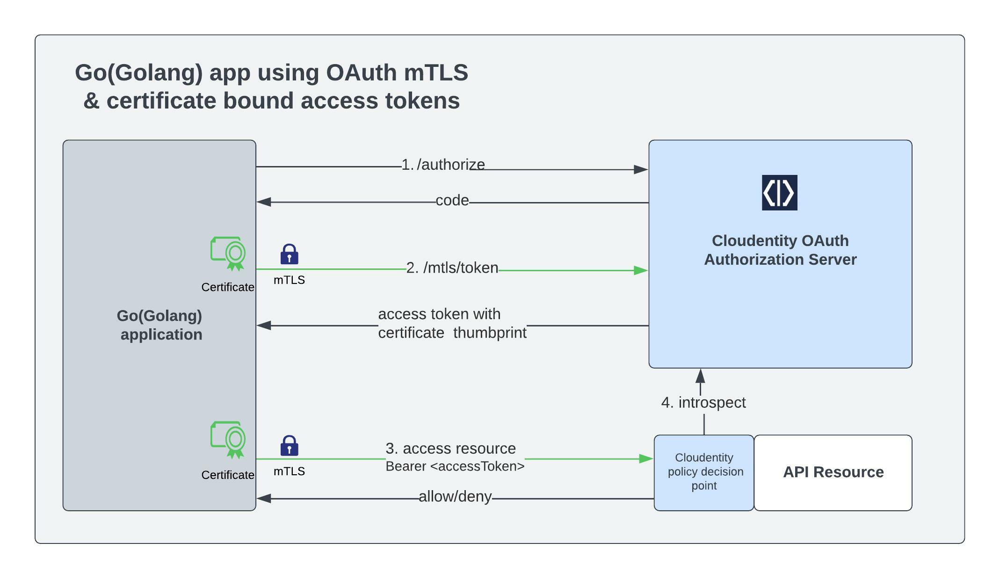

# Go app using OAuth mTLS with Cloudentity Authorization platform

Cloudentity authorization platform provides implementation for [RFC-8705 -OAuth 2.0 Mutual-TLS Client Authentication and Certificate-Bound Access Tokens](https://datatracker.ietf.org/doc/html/rfc8705) - OAuth client authentication using mutual TLS, based on either self-signed certificates or public key infrastructure (PKI). 

In this article , we will be creating a [Go(also known as Golang) application](https://go.dev/learn/) that acts like a mTLS client to fetch authorization token from Cloudentity authorization platform and then utilize the authorization token to access a protected resource over http using the TLS certificate bound access token issued by the Cloudentity authorization server.




 We will be using the Cloudentity Authorization Platform for our authorization server. We will also be using the [Cloudentity ACP OpenAPI Go Client](https://github.com/cloudentity/acp-client-go).

### Prerequisites

* Cloudentity Authorization Platform tenant - 
Cloudentity offers a free SaaS Tenant and [you can sign up for one, if you have not already got one](https://authz.cloudentity.io/register). With this you will get a free OAuth/OIDC compliant server with all the latest specifications.

* Application builder tools - We will build and run the application locally using docker
	* [Docker](https://www.docker.com) - Recommended v20.10.+
	* [Docker Compose](https://docs.docker.com/compose/) - Minimum v1.28.5
	* [Go](https://go.dev/) - Recommended v1.17 +

### Basic Concepts
OAuth 2.0 Mutual-TLS client authentication and certificate bound access tokens is explained in [RFC 8705](https://datatracker.ietf.org/doc/html/rfc8705). We have simplified it for you in case you want to understand usage scenarios with some simple examples
* [ OAuth mtLS implementation by Cloudentity overview](oauth-mtls-overview-cloudentity-platform.md)
* [Configure OAuth mTLS client authentication using self signed certificate](cloudentity-oauth-mtls-self-signed-client-authentication.md)
* [Configure OAuth mTLS client authentication using TLS](cloudentity-oauth-mtls-client-authentication.md)
* [Secure APIs with OAuth mTLS and certificate bound access token](securing-apis-with-certificate-bound-access-token.md)

### Source repo

We expect Go programming language experience to understand the programming constructs, in case you want to just run the application, jump to How to build and run the application after cloing the repo.

The source code for this entire exercise is [available in Github for reference](https://github.com/cloudentity/sample-go-mtls-oauth-client)

```bash
git clone git@github.com:cloudentity/sample-go-mtls-oauth-client.git
```

We will also be using the [Go Client built based on OpenAPI specifications for Cloudentity APIs](https://github.com/cloudentity/acp-client-go) in this article

### Building the Go Application

The [`main` function](https://github.com/cloudentity/sample-go-mtls-oauth-client/blob/master/main.go#L193) is very simple. It creates a server and starts it.

```go
func main() {
	var (
		server Server
		err    error
	)

	if server, err = NewServer(); err != nil {
		logrus.WithError(err).Fatalf("failed to init server")
	}

	if err = server.Start(); err != nil {
		logrus.WithError(err).Fatalf("failed to start server")
	}
}
```

The [`NewServer()` function](https://github.com/cloudentity/sample-go-mtls-oauth-client/blob/master/main.go#L193) does couple of interesting things
* parses the configuration and get the environment variables
* loads the templates used for the UI and 
* fetch the authentication and token endpoints to interact with Cloudentity authorization platform amd
* finally initializes the Cloudentity ACP Go Client and create a HTTP client for communication with Cloudentity authorization platform

```go
func NewServer() (Server, error) {
	var (
		config acp.Config
		server = Server{}
		err    error
	)

	if server.Tmpl, err = loadTemplates(); err != nil {
		return server, errors.Wrapf(err, "failed to load templates")
	}

	if server.Config, err = LoadConfig(); err != nil {
		return server, errors.Wrapf(err, "failed to load config")
	}

	if server.Config.Endpoints, err = fetchEndpointURLs(server.Config); err != nil {
		return server, errors.Wrap(err, "failed to fetch well-known endpoints")
	}

	if config, err = server.Config.NewClientConfig(); err != nil {
		return server, errors.Wrapf(err, "failed to get client configuration")
	}

	if server.Client, err = acp.New(config); err != nil {
		return server, errors.Wrapf(err, "failed to init acp client")
	}

	if server.HttpClient, err = newHTTPClient(server.Client, server.Config); err != nil {
		return server, errors.Wrapf(err, "failed to get http client")
	}

	server.SecureCookie = securecookie.New(securecookie.GenerateRandomKey(64), securecookie.GenerateRandomKey(32))

	return server, nil
}
```

 [Cloudentity ACP Go Client](https://github.com/cloudentity/acp-client-go/blob/master/README.md) can be treated as an SDK and it reduces boilerplate and makes our lives easier by handling the OAuth 2.0 interactions with the Cloudentity authorization server [once the relevant endpoints are configured](https://github.com/cloudentity/sample-go-mtls-oauth-client/blob/master/main.go#L44).

 ```go
 func (c Config) NewClientConfig() (acp.Config, error) {
	var (
		redirectURL *url.URL
		err         error
	)

	if redirectURL, err = url.Parse(fmt.Sprintf("http://%v:%v/callback", c.RedirectHost, c.PORT)); err != nil {
		return acp.Config{}, errors.Wrap(err, "failed to get callback url from host")
	}

	return acp.Config{
		ClientID:     c.ClientID,
		RedirectURL:  redirectURL,
		TokenURL:     c.Endpoints.TokenEndpoint,
		AuthorizeURL: c.Endpoints.AuthorizationEndpoint,
		IssuerURL:    c.Endpoints.Issuer,
		CertFile:     c.CertPath,
		KeyFile:      c.KeyPath,
		RootCA:       c.RootCA,
		Scopes:       []string{"openid"},
	}, nil
}
```

For this particular article, we are interested to create a Mutual TLS communication channel that can interact with Cloudentity Authorization platform for specific calls as highlighted in the initial diagram. To facilitate mTLS we need to provide the RSA public/private key pair and the root CA to be used during handshake with Cloudentity API endpoints. So we configure the http client that handles the traffic accordingly.

```go
func newHTTPClient(client acp.Client, config Config) (*http.Client, error) {
	var (
		pool  *x509.CertPool
		cert  tls.Certificate
		certs = []tls.Certificate{}
		data  []byte
		err   error
	)

	if client.Config.CertFile != "" && client.Config.KeyFile != "" {
		if cert, err = tls.LoadX509KeyPair(client.Config.CertFile, client.Config.KeyFile); err != nil {
			return nil, fmt.Errorf("failed to read certificate and private key %v", err)
		}

		certs = append(certs, cert)
	}

	if pool, err = x509.SystemCertPool(); err != nil {
		return nil, fmt.Errorf("failed to read system root CAs %v", err)
	}

	if client.Config.RootCA != "" {
		if data, err = os.ReadFile(client.Config.RootCA); err != nil {
			return nil, fmt.Errorf("failed to read http client root ca: %w", err)
		}

		pool.AppendCertsFromPEM(data)
	}

	return &http.Client{
		Timeout: client.Config.Timeout,
		Transport: &http.Transport{
			TLSClientConfig: &tls.Config{
				RootCAs:            pool,
				MinVersion:         tls.VersionTLS12,
				Certificates:       certs,
				InsecureSkipVerify: config.InsecureSkipVerify,
			},
		},
	}, nil
}
```

Now that we have gone over the basic configuration setup, the server is started by using below block. As you can see, it also has handlers for various routes that will be served by the server.

```go
func (s *Server) Start() error {
	handler := http.NewServeMux()
	handler.HandleFunc("/login", s.Login)
	handler.HandleFunc("/callback", s.Callback)
	handler.HandleFunc("/home", s.Home)
	handler.HandleFunc("/resource", s.Resource)

	httpServer := &http.Server{
		Addr:         fmt.Sprintf(":%v", s.Config.PORT),
		Handler:      handler,
		TLSNextProto: make(map[string]func(*http.Server, *tls.Conn, http.Handler), 0),
	}

	handler.Handle("/assets/", http.StripPrefix("/assets/", http.FileServer(http.Dir("./assets"))))

	log.Printf("Login endpoint available at: http://localhost:%v/login\nCallback endpoint available at: %v\n\n", s.Config.PORT, s.Client.Config.RedirectURL)

	if err := httpServer.ListenAndServe(); err != http.ErrServerClosed {
		log.Fatalln(err)
	} else {
		log.Println("server closed!")
	}

	return nil
}
```

Let's take a look at some of the main route handlers in `handler.go`. In the login handler, you will see the code flow to get authorization code using the OAuth PKCE flow First we look at the login handler. We begin by getting our authorization endpoint URL. In here, we also set an ecrypted cookie to protect against CSRF attacks.

```go
func (s *Server) Login(w http.ResponseWriter, r *http.Request) {
	var (
		data       map[string]interface{}
		encodedCookieValue string
		storage            AppStorage
		err                error
	)

	data = make(map[string]interface{})
	if data["auth"], storage.CSRF, err = s.Client.AuthorizeURL(); err != nil {
		s.renderError(w, ErrorDetails{http.StatusInternalServerError, fmt.Sprintf("failed to get authorization url: %+v", err)})
		return
	}

	if encodedCookieValue, err = s.SecureCookie.Encode("app", storage.CSRF); err != nil {
		s.renderError(w, ErrorDetails{http.StatusInternalServerError, fmt.Sprintf("error while encoding cookie: %+v", err)})
		return
	}

	http.SetCookie(w, &http.Cookie{
		Name:  "app",
		Value: encodedCookieValue,
		Path:  "/",
	})

	s.Tmpl.ExecuteTemplate(w, "home", data)
}
```

Based on the OAuth handshake, once user authorizes the authorization request initiated by this application, user will be redirected to the callback URL and it is handled by the `callback` handler. Within this we check couple of things
* authorization server has not returned any error for the authorization request
* verify the secure cookie??
* and finally exchange the authorization code for access token from Cloudentity authorization server.
* Cloudentity ACP Go client internally checks that the OAuth state parameter passed to authorization server is same as the one handed over to the server

It is important to note that this final exchange happens over the mTLS protected token endpoint configured for this application client. 

```go
func (s *Server) Callback(w http.ResponseWriter, r *http.Request) {
	var (
		code   = r.URL.Query().Get("code")
		cookie *http.Cookie
		errVal = r.URL.Query().Get("error")
		err    error
	)

	if errVal != "" {
		s.renderError(w, ErrorDetails{http.StatusBadRequest, fmt.Sprintf("acp returned an error: %s: %s", errVal, r.URL.Query().Get("error_description"))})
		return
	}

	if cookie, err = r.Cookie("app"); err != nil {
		s.renderError(w, ErrorDetails{http.StatusBadRequest, fmt.Sprintf("failed to get app cookie: %+v", err)})
		return
	}

	if err = s.SecureCookie.Decode("app", cookie.Value, &s.AppStorage.CSRF); err != nil {
		s.renderError(w, ErrorDetails{http.StatusBadRequest, fmt.Sprintf("failed to decode app storage: %+v", err)})
		return
	}

	if s.AppStorage.Token, err = s.Client.Exchange(code, r.URL.Query().Get("state"), s.AppStorage.CSRF); err != nil {
		s.renderError(w, ErrorDetails{http.StatusBadRequest, fmt.Sprintf("failed to get token: %+v", err)})
		return
	}

	http.Redirect(w, r, "/home", http.StatusFound)
}
```

If the mTLS token endpoint returns a successful response, we use the returned token and parse it for display on the UI. 
> NOTE: We use `parser.ParseUnverified` for simplicity but the documentation is clear `WARNING: Don't use this method unless you know what you're doing`. 


```go
func (s *Server) Home(w http.ResponseWriter, r *http.Request) {
	var (
		token  *jwt.Token
		claims []byte
		err    error
	)

	if s.AppStorage.Token.AccessToken == "" {
		s.renderError(w, ErrorDetails{http.StatusBadRequest, "missing access token"})
		return
	}

	parser := new(jwt.Parser)
	if token, _, err = parser.ParseUnverified(s.AppStorage.Token.AccessToken, jwt.MapClaims{}); err != nil {
		s.renderError(w, ErrorDetails{http.StatusBadRequest, fmt.Sprintf("unable to parse token %v", err)})
		return
	}

	if claims, err = json.MarshalIndent(token.Claims, "", "\t"); err != nil {
		s.renderError(w, ErrorDetails{http.StatusBadRequest, fmt.Sprintf("unable to format claims from token %v", err)})
		return
	}

	s.Tmpl.ExecuteTemplate(w, "home", map[string]interface{}{"Token": token.Raw, "UsePyron": s.Config.UsePyron, "FormattedClaims": string(claims)})
}
```

Let's take a pause for a moment and run the application to see what we have achieved.


### Calling protected resource


Finally, we use the certificate bound token to call the resource server. We intentionally do a few things for demonstrations purposes here that should not be done in a production application. We have an environment variable that sets `s.Config.InjectCertMode` and this should not be done in a real application. This is used because we are using a Pyron authorizer locally and we do not have TLS termination so the resource server cannot actually get the certificate and verify it against the hash. So we get the certificate thumbprint from the token here `certHash := r.FormValue("certhash")` and then if we are injecting that (`s.Config.InjectCertMode` is true - see the helper function below) then we can set a policy that checks for that header and then compares it certificate hash in the token. A real resource server would get the certificate hash from the token and then get the certificate from the TLS layer, hash it, and compare it directly.

```go
func (s *Server) Resource(w http.ResponseWriter, r *http.Request) {
	var (
		res          *http.Response
		resBodyBytes []byte
		err          error
	)

	if s.AppStorage.Token.AccessToken == "" {
		s.Tmpl.ExecuteTemplate(w, "error", s.AppStorage.Token)
		return
	}

	certHash := r.FormValue("certhash") // not checking if empty to allow for missing certificate thumbprint

	if res, err = s.fetchResource(certHash); err != nil {
		s.renderError(w, ErrorDetails{http.StatusBadRequest, fmt.Sprintf("client failed to fetch the resource %v", err)})
		return
	}
	defer res.Body.Close()

	if res.StatusCode != 200 && res.StatusCode != 403 {
		s.renderError(w, ErrorDetails{http.StatusInternalServerError, fmt.Sprintf("unexpected status code returned from resource server %v", err)})
		return
	}

	if resBodyBytes, err = io.ReadAll(res.Body); err != nil {
		s.renderError(w, ErrorDetails{http.StatusBadRequest, fmt.Sprintf("unable to fetch the resource %v", err)})
		return
	}

	resourceRes := map[string]interface{}{"Resource": true, "Status": res.StatusCode, "Content": string(resBodyBytes)}
	s.Tmpl.ExecuteTemplate(w, "home", resourceRes)
}
```
The last part is a helper function where we are adding the authorization header and optionally our demo injection of the cert hash in the `x-ssl-cert-hash`.
```
func (s *Server) newHTTPRequest(certHash string) (req *http.Request, err error) {
	if req, err = http.NewRequest("GET", s.Config.ResourceURL, nil); err != nil {
		return nil, err
	}

	req.Header = http.Header{
		"Content-Type":  []string{"application/json"},
		"Authorization": []string{fmt.Sprintf("Bearer %s", s.AppStorage.Token.AccessToken)},
	}

	// This is for demo purposes only. This can be configured in the environment variables.
	if s.Config.InjectCertMode {
		req.Header.Add("x-ssl-cert-hash", certHash)
	}

	return req, err
}
```

We have now covered the code and it is time to run the application.

### Configure application

### Building the Go OAuth Client

TODO// Move this to end

Before writing code we need to set some environment variables. The environment variables are used to configure our Go client to communicate with the import service that we set up in the previous step. Addtionally, it sets up [Cloudentity Pyron Authorizer](https://docs.authorization.cloudentity.com/guides/developer/protect/pyron/). You can use any authorizer, or none at all, but we use it here due to running locally and since we don't have TLS termination we can 'fake' the mTLS flow by injecting the certificate thumbprint into a header. This allows us to play with the policy settings in [Cloudentity Authorization Platform](https://authz.cloudentity.io/). We also set the environment variables with the Tenant ID and Tenant URL so that we can access the `.well-known` endpoint of our client application in [Cloudentity Authorization Platform](https://authz.cloudentity.io/). We need to access the `.well-known` endpoint to get the authorization and token endpoint URLs.

Go to the home directory of the Go application repository. In the `.env` file and fill in the following using the items we copied above:
 -	CONFIGURATION_TENANT_URL
 -	CONFIGURATION_TENANT_ID 
 -	CONFIGURATION_CLIENT_ID 
 -	CONFIGURATION_CLIENT_SECRET 


### Preparing Cloudentity SaaS
First we are going to set up a service in [Cloudentity Authorization Platform](https://authz.cloudentity.io/) so that we can import a workspace and a client application that will act as our authorization server. The import client is for convenience and brevity of this article and is not required to set up an authorization server.  To use the import client we need to add a few environment variables to the `.env` file in our repo that allows the application to access our newly created import application. To see how to setup the client application manually, checkout [Sample Go MTLS Oauth Client](https://github.com/cloudentity/sample-go-mtls-oauth-client).

Now let's get the import service working:
 -	Login in to Cloudentity SaaS https://authz.cloudentity.io/
 -	From the list in `Administrative Workspace` choose the `System` workspace.
 -	On the navigation menu go to `Applications->Clients`.
 -	Choose `CREATE APPLICATION`
 -	Give the client application a name and from the `Choose an application type` section choose `Service`.
 -	After the client is created choose the `Scopes` tab.
 -	With the `Scopes` tab chosen, under `Management` turn on `manage_configuration`.
 -	From the OAuth tab copy the Client ID and Client Secret as you will add these for importing the OAuth client app. These are your CONFIGURATION_CLIENT_ID and CONFIGURATION_CLIENT_SECRET.
 -	In the top right of Cloudentity SaaS copy your `tenant` which is your CONFIGURATION_TENANT_ID.
 -	Finally,on the left hand menu choose `Auth Settings-> OAuth` and copy the Authorization URL. This is your authorization URL for your system. What we need is the Tenant URL for your new client app that will be created. To get the Tenant URL remove `system` from the end of the URL. This is your CONFIGURATION_TENANT_URL.

With the import client now created, we can move on to creating the Go client application.

### Running the Application

With our environment variables set, we can now run the Go application. From  the root directory of the sample app run:
```
make run-all
```
This will kick of the import of our OAuth client application in Cloudentity Authorization Platform. Then it will start our Go OAuth client server. Once the import is complete and the Go application is running you should see in the terminal that the login URL has been displayed as ` http://localhost:18888/login` Go to this URL and you will see conceptual information. Take a moment to read the conceptual information provided and go through the OAuth flow go using mTLS to get an access token. You will then be able to access a protected resource using certificate bound access tokens by clicking `Fetch Resource`.

Take a moment to look at the OAuth Client application created in Cloudentity Authorization Platform. You will see a newly created workspace. Go to the new workspace and go to  `Applications->Clients->MTLS Sample Client`. Under the OAuth tab, you can see that the token endpoint authentication method is set to `TLS Client Authentication` and `Certificate bound access tokens` is checked. Under `Auth Settings->OAuth-> TLS Client Authentication` scroll down and you will see that TLS Client Authentication is checked and our trusted client certificate has been pasted in.  Go to `Enforcement->APIs` and you will see that there are APIs that have been imported. The sample app uses the `/balance` API. You should see that it show 'unrestricted'. Click on `unrestricted` and set the policy to `sample-mtls-policy`. Go through the OAuth flow again and see that it passes. Now change the certificate hash that is displayed above the `Fetch Resource` button and you should get a 403 when trying to access the resource. Note: As mentioned the certificate thumbprint is sent in the Authorization header and it is the resource servers responsibility to compare this with its own hash of the certificate. The policy here is just for this demo. 

### Conclusion
We very briefly went over OAUTH using certificate bound access token concepts. Leveraging the capabilities of the Cloudentity Authorization Platform and the Cloudentity ACP OpenAPI Go Client we were able to quickly and easily set up a Go OAuth client application to obtain certificate bound access tokens and use those tokens to access a protected resource.

### Relevant Links
 - [RFC 6749](https://datatracker.ietf.org/doc/html/rfc6749)
 - [RFC 8705](https://datatracker.ietf.org/doc/html/rfc8705)
 - [Extra steps for manually creating the client application in Cloudentity Authorization Platform](https://github.com/cloudentity/sample-go-mtls-oauth-client)
 - [ACP Client Go](https://github.com/cloudentity/acp-client-go)


