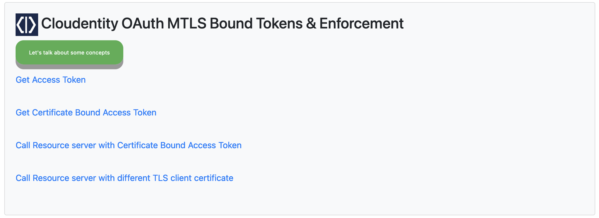

# Node.js app using OAuth mTLS with Cloudentity Authorization Platform

Cloudentity authorization platform completely supports [RFC 8705](https://datatracker.ietf.org/doc/html/rfc8705) for OAuth 2.0 Mutual-TLS Client Authentication and Certificate-Bound Access Tokens.

As you might already be aware, Cloudentity platform is compliant with the latest emerging OAuth specifications and can support in modernizing the application architectures with latest open standards and specfications support. We will take you down the path of understanding use cases that can be addressed using the mTLS specification and code samples in various languages on how to integrate and utilize the latest specification in your new architecture patterns.

In this specific section, we will be creating a Node.js application which will access a protected resource with certificate bound access tokens. Additionally, we will use [Cloudentity Pyron authorizer](https://docs.authorization.cloudentity.com/guides/developer/protect/pyron/) to enforce that the access token includes the certificate thumbprint and it matches the certifiate used by the client application.

This article is geared towards showing a backend application calling another service.

## Pre-requisites

* Cloudentity Authorization Platform tenant - Cloudentity offers a free SaaS Tenant and [you can sign up for one, if you have not already got one](https://authz.cloudentity.io/register). With this you will get a free OAuth/OIDC compliant server with all the latest specifications.

* Application builder tools - We will build and run the application locally
	* [Node.js](https://nodejs.org)  - Recommended v16.x+
	* [npm](https://www.npmjs.com)

### Basic Concepts

OAuth 2.0 Mutual-TLS client authentication and certificate bound access tokens is explained in [RFC 8705](https://datatracker.ietf.org/doc/html/rfc8705). We have simplified it for you in case you want to understand usage scenarios with some simple examples
* [OAuth mTLS implementation by Cloudentity overview](oauth-mtls-overview-cloudentity-platform.md)
* [Configure OAuth mTLS client authentication using self signed certificate](cloudentity-oauth-mtls-self-signed-client-authentication.md)
* [Configure OAuth mTLS client authentication using TLS](cloudentity-oauth-mtls-client-authentication.md)
* [Secure APIs with OAuth mTLS and certificate bound access tokens](securing-apis-with-certificate-bound-access-token.md)

Let's look at an overview of how mTLS works to help secure your application from rogue callers that have obtained an access token.
.

When not using mTLS the client is issued an access token. Unfortunately, a rogue application has also obtained this access token. When not using mTLS, anyone in possession of the access token is able to access a protected resource using that access token. 

Fortunately, there is a way to prevent a rogue caller from using a stolen access token. Mutual-TLS as described in [RFC 8705](https://datatracker.ietf.org/doc/html/rfc8705). The client is issued an access token. A rogue caller obtains the access token. However, since mTLS is used the client certificate is bound to the access token. Since the rogue caller does not have access to the certificate, the rogue caller attempts to use the access token and the resource server denies access to the protected resource since the certificate does not match the certificate thumbprint bound to the access token.

### Source repo

To just run the application, jump to [Running the client application](#running-the-client-application) and run the application after cloning the repo and entering your environment variables.

The source code for this entire exercise is [available in Github for reference](https://github.com/cloudentity/ce-samples-mtls-demo/tree/master/sample-nodejs-mtls-oauth-client)

```bash
git clone https://github.com/cloudentity/ce-samples-mtls-demo.git
```

The repo contains several example projects. Change directory into the sample nodejs oauth client directory
```bash
cd ce-samples-mtls-demo/sample-nodejs-mtls-oauth-client
```

### Building the Node.js client application

First, in `index.js` import the required required packages.

``` javascript
var axios = require('axios');
var qs = require('qs');
var express = require('express');
var app = express();
var jwt_decode = require('jwt-decode');
var fs = require('fs');
var https = require('https');

var mustacheExpress = require('mustache-express');
var bodyParser = require('body-parser');
var path = require('path')
require('dotenv').config();
```

Then [set up](https://github.com/cloudentity/sample-go-mtls-oauth-client/blob/master/main.go#L193) the express app to serve some views and html pages.

```javascript
app.set('views', `${__dirname}/views`);
app.set('view engine', 'mustache');
app.engine('mustache', mustacheExpress());
app.use (bodyParser.urlencoded( {extended : true} ) );
app.use(express.static(path.join(__dirname, "/public")));
```

Next, [obtain](https://github.com/cloudentity/ce-samples-mtls-demo/blob/017a33ae63334789bbc9a87f6894a68cca431167/sample-nodejs-mtls-oauth-client/index.js#L24) client credentials and OAuth token URL for our non-mTLS application from our environment variables.
```javascript
const client_id = process.env.OAUTH_CLIENT_ID; 
const client_secret = process.env.OAUTH_CLIENT_SECRET; 
const token_url = process.env.OAUTH_TOKEN_URL; 
const auth_token = Buffer.from(`${client_id}:${client_secret}`, 'utf-8').toString('base64');
```

Using Mutual-TLS requires the use of a certificate and public key. These are [read](https://github.com/cloudentity/ce-samples-mtls-demo/blob/017a33ae63334789bbc9a87f6894a68cca431167/sample-nodejs-mtls-oauth-client/index.js#L30) from the file system used to initialize the `https.Agent`. The environment variables that will be used with mTLS OAuth server are then read in. 
```javascript 
const httpsAgent = new https.Agent({
  cert: fs.readFileSync('full_chain.pem'),
  key: fs.readFileSync('acp_key.pem'),
});

const mtls_client_id = process.env.MTLS_OAUTH_CLIENT_ID; 
const mtls_token_url = process.env.MTLS_OAUTH_TOKEN_URL; 
```


[Set up the port](https://github.com/cloudentity/ce-samples-mtls-demo/blob/00aad5ee9ab3074c0904fc6725dda24ce7838837/sample-nodejs-mtls-oauth-client/index.js#L39) and log the URL for the starting point of the application. Then a `/health` endpoint is set up to verify that everything is up and running.
```javascript
const port = process.env.PORT;
app.listen(port);

console.log(`Server listening at http://localhost:${port}/home`);

app.get('/health', function (req, res) {
  res.send('Service is alive and healthy')
});
```

Next, set up the primary application routes to serve traffic for the OAuth flow.

[Define](https://github.com/cloudentity/ce-samples-mtls-demo/blob/00aad5ee9ab3074c0904fc6725dda24ce7838837/sample-nodejs-mtls-oauth-client/index.js#L48) a `/home` route to render the home page which will be the kick off point for retrieving an access token. 
```javascript
app.get('/home', function(req, res) {
  res.render('home', {} )
})

```

Once the application is running and the end user visits `http://localhost:5002/home`, the user is presented with the following UI.


The home page displays links for fetching an access token through traditional OAuth 2.0 client credentials flow. Additonally, a certificate bound access token using mTLS can be chosen. 

When the user selects `Get Access Token` from the UI, the route `/auth` is called which fetches a regular access token that is not certificate bound. [Here](https://github.com/cloudentity/ce-samples-mtls-demo/blob/00aad5ee9ab3074c0904fc6725dda24ce7838837/sample-nodejs-mtls-oauth-client/index.js#L52) `client_credentials` is used for the grant type. The token is then decoded and displayed in the UI.

```javascript

app.get('/auth', function(req, res) {
  getAuth().then(value => {
   if(value !== undefined) {
     var decoded = jwt_decode(value);
    res.render('home', {accessToken: JSON.stringify(decoded, null, 4)} )
   } else {
     res.send("No token fetched!")
   }
 }, err => {
   res.send("Unable to fetch token!")
 })
 
});

const getAuth = async () => {
  try {
    const data = qs.stringify({'grant_type':'client_credentials'});
    const response = await axios.post(token_url, data, {
      headers: { 
        'Authorization': `Basic ${auth_token}`,
        'Content-Type': 'application/x-www-form-urlencoded' 
      }
    })
    return response.data.access_token; 
  } catch(error){
    console.log(error);
  }
}
```

[Now](https://github.com/cloudentity/ce-samples-mtls-demo/blob/00aad5ee9ab3074c0904fc6725dda24ce7838837/sample-nodejs-mtls-oauth-client/index.js#L81) a certificate bound access token will be fetched. When the user clicks `Get Certificate Bound Access Token` from the UI, the route `/mtlsauth` is called which fetches a certificate bound access token. The `getMtlsAuth` function is invoked where the grant type is set to client credentials and then the token endpoint is called. [RFC 8705](https://datatracker.ietf.org/doc/html/rfc8705) states `For all requests to the authorization server utilizing mutual-TLS client authentication, the client MUST include the "client_id"` so the client ID is included. The `httpsAgent` is used which will include our certificate and public key.

```javascript
app.get('/mtlsauth', function (req, res) {
  getMtlsAuth().then(value => {
    if (value !== undefined) {
      var decoded = jwt_decode(value);
      res.render('home', { certificate_bound_access_token: JSON.stringify(decoded, null, 4) })
    } else {
      res.send("No token fetched!")
    }
  }, err => {
    res.send("Unable to fetch token!")
  })
});

const getMtlsAuth = async () => {
  try {
    const data = qs.stringify({ 'grant_type': 'client_credentials', 'client_id': mtls_client_id });

    const httpOptions = {
      url: mtls_token_url,
      method: "POST",
      httpsAgent: httpsAgent,
      headers: {
        'Content-Type': 'application/x-www-form-urlencoded'
      },
      data: data
    }

    const response = await axios(httpOptions)
    return response.data.access_token;
  } catch (error) {
    console.log(error);
  }
}

```


After getting a certificate bound access token, the user can then access a protected resource by clicking the `Call Resource server with Certificate Bound Access Token` button on the UI. The `/mtls-resource` [handler](https://github.com/cloudentity/ce-samples-mtls-demo/blob/00aad5ee9ab3074c0904fc6725dda24ce7838837/sample-nodejs-mtls-oauth-client/index.js#L116) is called which then calls the protected resource API including the certificate bound access token in the `Authorization` header. Once the response is returned, it is rendered in the UI. If access to the protected resource is allowed then display the JSON response. Otherwise, display an error that the protected resource access was not authorized. 

```javascript
const resource_url = process.env.MTLS_RESOURCE_URL; // Resource server URL

app.get('/mtls-resource', function (req, res) {
  getMtlsAuth().then(value => {
    if (value !== undefined) {
      var decoded = jwt_decode(value);
      callResourceServerMtlsAPI(value).then(value => {
        if (value !== undefined) {
          res.render('home', { mtls_resource: JSON.stringify(value, null, 4) })
        } else {
          res.send("No response fetched!")
        }
      }, err => {
        res.send("Unable to fetch the resource!")
      })
    }
  });
});

const callResourceServerMtlsAPI = async (accessToken) => {
  try {
    const httpOptions = {
      url: resource_url,
      method: "GET",
      httpsAgent: httpsAgent,
      headers: {
        'Content-Type': 'application/json',
        'Authorization': 'Bearer ' + accessToken
      }
    }

    const result = await axios(httpOptions)
    return result.data;
  } catch (error) {
    console.log(error);
  }
}
```

The user [can also try](https://github.com/cloudentity/ce-samples-mtls-demo/blob/00aad5ee9ab3074c0904fc6725dda24ce7838837/sample-nodejs-mtls-oauth-client/index.js#L154) and fetch the protected resource using a different certificate. Because Mutual-TLS is used, if a different certificate is used then the client application will be unable to access the resource and an error will be displayed.
```javascript
const callResourceServerMtlsAPiAsRogueCaller = async (accessToken) => {
  try {
    const httpOptions = {
      url: resource_url,
      method: "GET",
      httpsAgent: rogueHttpsAgent,
      headers: {
        'Content-Type': 'application/json',
        'Authorization': 'Bearer ' + accessToken
      }
    }

    const result = await axios(httpOptions)
    return result;

  } catch (error) {
    console.log(error);
    return error;

  }
}
```

### Running the client application

## Prepare Cloudentity Authorization Platform
Configure OAuth applications in Cloudentity Authorization Platform. Directions on configuring the client applications can be found [here](https://github.com/cloudentity/ce-samples-mtls-demo/blob/nodejs-mtls/docs/cloudentity-oauth-mtls-client-authentication.md). 

## Prepare Pyron Authorizer
When accessing a protected resource, an authorizer will be used. The authrorizer will terminate TLS, get the certificate, take the thumbprint, and finally compare it to the certificate thumbprint bound to the token.

First, set up Pyron authorizer in your Cloudentity Authorization Platform workspace following this [guide](https://docs.authorization.cloudentity.com/guides/developer/protect/pyron/pyron/?q=pyron). There is no need to download the authorizer as a docker image will be pulled when running the application. However, the credentials for the authorizer are necessary.

Copy the Client ID, Client Secret and ISSUER URL from the 'Settings' tab of the authorizer as shown. These will be used when setting environment variables in the next section.
)

## Prepare and run the client application
Go to the root of the project `sample-nodejs-mtls-oauth-client`. From the root of the repo enter the following in terminal.
```bash
cd sample-nodejs-mtls-oauth-client
```

In the `.env` [file](https://github.com/cloudentity/ce-samples-mtls-demo/blob/8917632d47ff87720c8c52d2ac5e03cbeb33df25/sample-nodejs-mtls-oauth-client/.env#L1) enter the OAuth server variables that were copied before in the following:
 - OAUTH_CLIENT_ID="`<your oauth client id that is not using mtls>`"
 - OAUTH_CLIENT_SECRET="`<your oauth client secret that is not using mtls>`"
 - OAUTH_TOKEN_URL="`<your oauth client token url that is not using mtls>`"
 - MTLS_OAUTH_CLIENT_ID="`<your oauth client id that is using mtls>`"
 - MTLS_OAUTH_TOKEN_URL="`<your oauth client token url that is using mtls>`"

Now enter the environment variables for the Pyron authorizer in the `.env` [file](https://github.com/cloudentity/ce-samples-mtls-demo/blob/0ba02891d908662771294f21007c44af87b86e98/sample-nodejs-mtls-oauth-client/.env#L10):
 - ACP_ISSUER_URL="`<your issuer URL as shown in Pyron settings>`"
 - ACP_CLIENT_ID="`<your client id found in Pyron settings>`"
 - ACP_CLIENT_SECRET="`<your client secret found in Pyron settings>`"
 - ACP_TENANT_ID="`<your tenant id>`"


Once the environment variables are set then run the application by entering the following in the terminal:
```bash
make run-all
```

Once the application is running you should see `http://localhost:5002/home` printed in the terminal. Go to that URL, get an access token, and then use the access token to obtain a protected resource. Once Pyron authorizer is running the APIs are automatically bound in Cloudentity Authorization Platform. However, there is no policy currently set on the APIs to prevent access without a certificate bound access token. Go to [Cloudentity Authorization Platofrom](https://authz.cloudentity.io/) and [create a policy](https://docs.authorization.cloudentity.com/guides/developer/protect/access_control/create_auth_policy/?q=policy). Add the following policy. Note: You can save this policy to a file and from the policy editor you can then upload the policy by clicking on the 3 dots in the upper right and choosing 'Upload'.

```
validators:
  - name: attributes
    conf:
      fields:
        - comparator: equals
          field: 'request.mtls.x5t#S256'
          value: '$authnCtx.cnf.x5t#S256'
    recovery: null
```

This policy checks that the access token includes the `cnf` claim with the certificate thumbprint that was bound to the token. It then takes the hash of the certificate obtained in the TLS layer and compares it the the certificate hash from the token. If they match then access to the resource is allowed, otherwise access is rejected.

Now from the client application UI, try accessing a resource again. Try it using a different certificate by using the rogue caller link. 


### Conclusion

We demonstrated that Cloudentity authorization platform fully supports [RFC 8705](https://datatracker.ietf.org/doc/html/rfc8705) for OAuth 2.0 Mutual-TLS Client Authentication and Certificate-Bound Access Tokens by creating a Node.js client application that accesses a protected resource using certificate bound access tokens. Basic concepts were coverend and then we went through the code to see how with just a few lines of code we can take advantage of the extra protection that Mutal-TLS offers us. 

Take some time to go through the links and learn more about OAuth 2.0 and Cloudentity Authorization Platform. 

### Relevant Links

 - [Cloudentity Authorization Platform](https://authz.cloudentity.io/)
 - [RFC 6749](https://datatracker.ietf.org/doc/html/rfc6749)
 - [RFC 8705](https://datatracker.ietf.org/doc/html/rfc8705)
 - [Cloudentity product documentation here](https://docs.authorization.cloudentity.com/)

