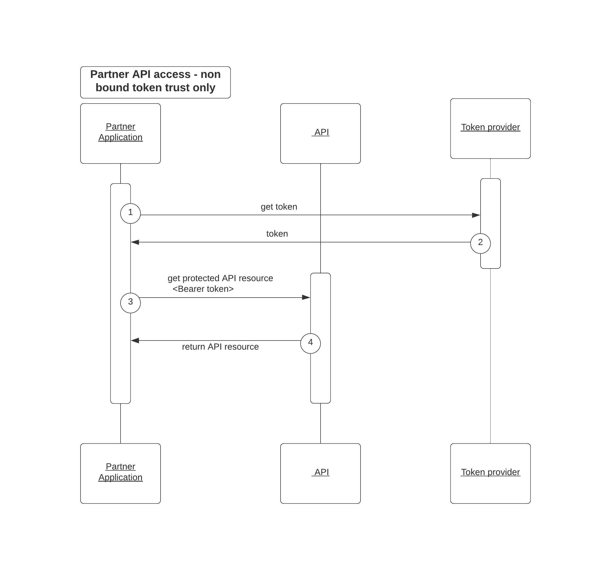

# Securing partner API integrations with OAuth mTLS

API access using token based architectures are already popular and the authorization and governance of the minted tokens for access becomes very critical
for the APIs exposing data for partner integrations or other data consumers. This is exactly where we can utilize the powerful authorization and governance
capability of Cloudentity platform along with the OAuth specification extension for mTLS interaction to increase API security. Cloudentity acts as the OAuth authorization server and token issuer based on OAuth specifications to govern and protect API resource
request and access.

One of the common approaches prelevant is to use the bearer tokens (access token) to authorize a client and as long as there is a bearer token, it is usually enough to gain accessto the API. This approach certainly has the glaring problem that whoever has the token can gain access to the API.

Another approach that is prelevant is just using the certificates in mTLS mode to 
to identify and trust the calling application(client) and then grant access to the resource server API with no other authorization checks(or may be a static API key check). This approach certainly lacks the authorization intent scoped tokens that can be
governed effectiviely. 

**What if we combine both the above approaches to negate each others drawbacks?**
Such a combination certainly strengthens the API security for communication between the calling application and the server and is certainly made possible with the OAuth 2.0 specifications for Mutual Transport Layer Security.

Cloudentity authorization platform provides complete implementation for [RFC-8705 -OAuth 2.0 Mutual-TLS Client Authentication and Certificate-Bound Access Tokens](https://datatracker.ietf.org/doc/html/rfc8705) - OAuth client authentication using mutual TLS, based on either self-signed certificates or public key infrastructure (PKI). With
this implementation, the server is capable of supporting 2 main concepts that can be
utilized to further secure the API interaction
* mTLS token endpoint for access tokens and
* certificate bound access tokens

## Secure API communication in Partner Integration Ecosystem 

In a partner integration ecosystem, there is an inherent trust but at the same time there is also need the capability to fine grain control API access to each of the partners within the ecosystem. It is even possible that each of the partners might be allowed only certain API access based on the partners agreements, trust and data handling capabilities. Even within a partner, there could be case to have different set of application with varying requirement for API access. This is becoming
more relevant and critical as there are standards being formulated across the globe
for data sharing in various industries. So its very essential that the token
issued to each of the partner client applications is narrowly scoped with proper authorization checks. And also at the same time there is the need to make sure the tokens are used only by the 
authorized partner application to whom the token was issued and is not being shared across multiple partners or partner applications etc..

Combining the power for mTLS along with a token that is bound to that provides a secure and robust architecture for handling server to server communication within the
partner integration ecosystem. In other terms, we will utilize the trust established by the certificate presented by the client application during the token minting process to
be validated during the token usage phase and this can be faciliated by the certificate thumbprint(`cnf`) claim in the certificate bound access token to increase the security.

Cloudentity authorization server acting as the centralized token service will issue tokens only after governance checks that is represented as dynamic authorization policies at various levels including 
* workspace level policy
* application level policy
* scope and claim level policy

These tokens are issued to requesting applications with limited access and is also
bound with the certificate thumbprint of the certificate used during the request for token minting.  Its highly common that a partner could utilize the same token (given all their apps has access to the private key) for further calls but the benefit is tht the certificate itself would not be shared across various partners that are registered to use the API.

Cloudentity authorization server supports all the specification aspects that includes highlights such as
* tls signed client authentication
* self signed tls client authentication
* certificate bound access token
* tls certificate match on various SAN including email, uri, ipaddress, name etc
* issue binding/non-binding access tokens
* introspection/revocation endpoints 
* enforce mtls setting at global level/client level

## Summary

We have seen that the traditional access token based resource access comes with some vulnerabilities and we can evolve architectures to a more secure model and force the
partner/consumers of the API ecosystem to a more secure model. Leveraging the OAuth mTLS specification enhance the security model and this model can be utilized for environments wth strict data security and high security data access requirements across partner organizations or environments. At the end of the day, its all our responsibility to keep the data travelling across the wire safe from misuse.
You can jump right in and explore all the capabilities offered by Cloudentity

[Register for a free Cloudentity SaaS tenant](https://authz.cloudentity.io/register) to try and checkout our [OAuth & open standard based authorization solutions and features](https://docs.authorization.cloudentity.com/) for your modern applications and to tighten and secure your application & API architecture further more.

