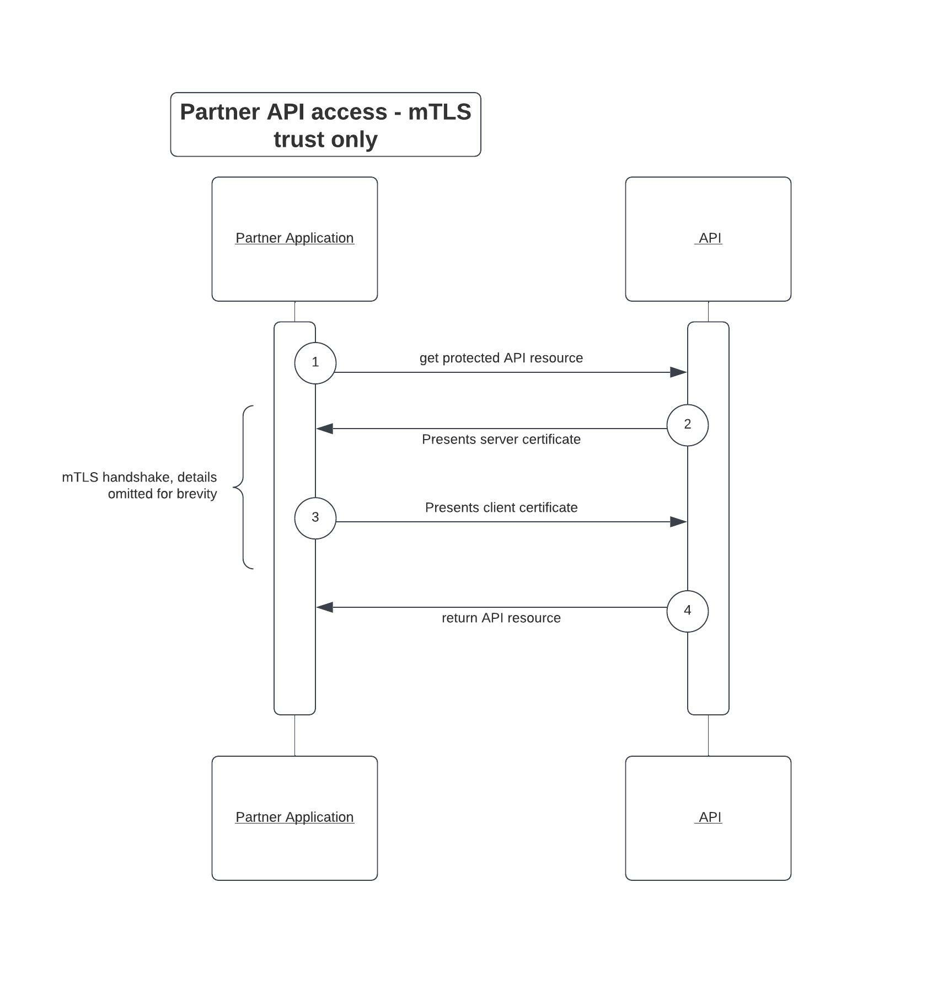

# Securing partner API integrations with OAuth mTLS

API access using token based architectures is already popular, and the authorization and governance of the minted tokens for access becomes very critical
for APIs, which exposes data for partner integrations outside of the organization itself. This is exactly where we can utilize the OAuth mTLS specification along with the powerful authorization and governance
capability of Cloudentity platform to increase API security. Cloudentity acts as the OAuth authorization server and token issuer based on OAuth specifications to govern and protect API resource
request and access.

One of the common approaches prevalent is to use the bearer tokens (access token) to authorize a client, and as long as there is a bearer token, it is usually enough to gain access to the API. This approach certainly has the glaring problem that whoever has the token can gain access to the API. There is another problem with the secret used to identify the client that is trying to authorize to fetch the token. The secret is normally handled using an API key or client credentials flow, and we rely on the partner application to securely store this secret which is also another attack surface outside the control of the main organization.

Another approach that is prevalent is using the certificates in mTLS mode 
to identify and trust the calling application (client) and then grant access to the resource server API with no other authorization checks (or may be a static API key check). This approach certainly lacks the authorization intent scoped tokens that can be
governed effectively to ensure that the caller is allowed to actually mint the tokens and having a certificate should not be the only criteria. 

**What if we combine both the above approaches to negate each drawback?**

Such a combination certainly strengthens the API security for communication between the calling application and the server and is certainly made possible with the OAuth 2.0 specifications for Mutual Transport Layer Security.

[Cloudentity authorization platform](https://cloudentity.com/) provides complete implementation for [RFC8705 - OAuth 2.0 Mutual-TLS Client Authentication and Certificate-Bound Access Tokens](https://datatracker.ietf.org/doc/html/rfc8705) - OAuth client authentication using mutual TLS, based on either self-signed certificates or public key infrastructure (PKI). With
this implementation, the server is capable of supporting two main concepts that can be
utilized to further secure the API interaction:
* mTLS token endpoint with tls/self signed client authentication methods for access tokens
* certificate bound access tokens

## Secure API Communication in Partner Integration Ecosystem 

In a partner integration ecosystem, there is an inherent trust but at the same time there is also a need for the capability to fine grain control API access to each of the partners within the ecosystem. It is even possible that each of the partners needs to be allowed only to access selected APIs based on the partners agreements, trust and data handling capabilities. Even within a partner, there could be a case to have a different set of applications with varying requirement for selected API access. This is becoming
more relevant and critical as there are standards being formulated across the globe
for data sharing in various industries. So it's very essential that the token
issued to each of the partner client applications is narrowly scoped with proper authorization checks and can be governed and enforced when presented to access APIs. At the same time, there is the need to make sure the tokens are used only by the 
authorized partner application to whom the token was issued and is not being shared across multiple partners or partner applications.

Combining the power of mTLS along with a token that is bound to the certificate provides a secure and robust architecture for handling server to server communication, sometimes referred to as machine to machine communication or m2m communication, within the
partner integration ecosystem. In other terms, we will utilize the trust established by the certificate presented by the client application during the token minting process to
be validated during the token usage phase for resource access, and this is faciliated by the certificate thumbprint (`cnf`) claim in the certificate bound access token.

Furthermore, this approach also eliminates the need to distribute `API keys` or `client secrets` to authenticate the OAuth client to fetch the token. So there is one less `secret` to worry about that can be comprimised by your partner organization. The client requesting the token is authenticated using the same mTLS communication channel by matching pre-configured criteria in the certificate presented in the TLS handshake. So the responsibility is more on the partner organization itself to keep their keys secure enough, and there is no secret from the API provider organization that needs to be stored/secured by the partner applications.

[Cloudentity authorization server](https://docs.authorization.cloudentity.com/acp_overview/acp_overview/) acts as the centralized token service and will issue tokens only after passing the governance checks, represented as dynamic authorization policies, that can be configured at various levels including:
* workspace level policy
* application level policy
* scope and claim level policy

These tokens are issued to requesting applications with limited access and are also
bound with the certificate thumbprint of the certificate used during the request for token minting. 

Cloudentity authorization server supports all the [OAuth mTLS specification](https://datatracker.ietf.org/doc/html/rfc8705) highlights such as
* tls signed client authentication
* self signed tls client authentication
* certificate bound access token
* tls certificate match on various SAN including email, uri, ipaddress, name etc
* issue binding/non-binding access tokens
* introspection/revocation endpoints 
* enforce mtls setting at global level/client level

## Summary

We have seen that the traditional access token based resource access comes with some vulnerabilities, and we can evolve application architectures to a more secure model using open standards and force the partner/consumers of the API ecosystem to adopt those best practices for secure data exchange using APIs. Leveraging the OAuth mTLS specification enhances the security model and reduces secrets usage compared to older techniques like client secret or API key for caller identification. This model can be utilized for environments with high data security access policy requirements across partner organizations or environments. Our recommendation would be to use it for any data sharing usecase across your partners, irrespective of the security access policies. At the end of the day, it's all our responsibility to keep the data traveling across the wire safe from misuse.

[Register for a free Cloudentity SaaS tenant](https://authz.cloudentity.io/register) to get an OAuth authorization server. Also, explore the Cloudentity platform for the latest [OAuth & open standard based authorization solutions and features](https://docs.authorization.cloudentity.com/) for your modern applications and learn how Cloudentity can accelerate and facilitate security, governance and best practices adoption for your application & API architecture ecosystem.

