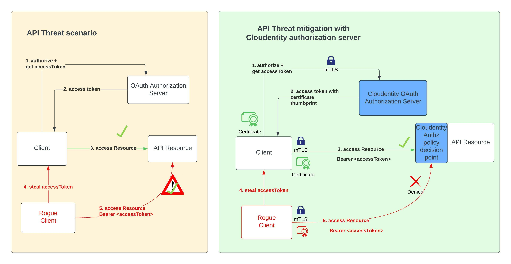

# Secure APIs with OAuth Certificate Bound Access Tokens and mTLS

Cloudentity authorization platform provides implementation for [RFC-8705 -OAuth 2.0 Mutual-TLS Client Authentication and Certificate-Bound Access Tokens](https://datatracker.ietf.org/doc/html/rfc8705) - OAuth client authentication using mutual TLS, based on either self-signed certificates or public key infrastructure (PKI). 

With this specification support for binding the OAuth access token to the clients certificate, we can
* prevent the use of stolen access tokens
* replay of access tokens by unauthorized parties

Mutual-TLS certificate-bound access tokens ensure that only the party in possession of the private key corresponding to the certificate can utilize the token to access the associated resources. This constraint is
commonly referred in multiple terms like
 * key confirmation
 * proof of possession
 * holder of key


  
Let's talk a look at how Cloudentity enables support for this to secure your APIs

* Register an OAuth client application in Cloudentity OAuth authorization server
* Enable mTLS client authentication on the OAuth client application
* Enable certificate bound access token for above client to imprint certificate thumb print in tokens
* Client should call the mtlS token endpoint in Cloudentity OAuth authorization server
* Client can now call the the secure API resource with the certificate bound access token

### How to quickly see this in action?

Let's see this in action with some quick demonstrations

1. [Register for a free Cloudentity SaaS tenant, if you have not already done it](https://authz.cloudentity.io/register)
   * Activate the tenant and take the self guided tour to familiarize with the platform

2. Create an OAuth client application and configure mTLS criteria
   * Choose the application type as `service`, which will configure the grant type as `client_credentials`. We are choosing this as its easy to demonstrate and skips the authorize flow. 
   We have provided some sample application code snippets in other articles attached below that goes through more complex flows.
   * Select the `Token Endpoint Authentication Method` as `Self Signed TLS Client Authentication` or `TLS Client Authentication`
   * Configure jwks_uri or json web key set(for self signed certificate). [Checkout this article for more details about OAuth mTLS using self signed certificate](cloudentity-oauth-mtls-self-signed-client-authentication.md)
   * Configure certificate metadata matching criteria from one of the below (for tls authentication)[Checkout this article for more details about OAuth mTLS using TLS](cloudentity-oauth-mtls-client-authentication.md)
      * subject DN
      * DNS SAN
      * ipAddress SAN
      * email SAN

3. Check the box for `Certificate bound access token` in case you need the certificate thumprint bound in the access token. If checked, this will add a new JWT Confirmation Method member `"x5t#S256"` that adheres to [RFC-8700](https://datatracker.ietf.org/doc/html/rfc7800) - Proof of Posession semantics specifictions for JSON web tokens. [`Certificate bound access token` feature can be used to increase API security, as detailed in the linked article](securing-apis-with-certificate-bound-access-token.md)   

4. Now that the client has been configured let's try to get an access Token from the authorization server using client credentials flow

#### Fetch access tokens 

While mTLS is great for security, it can be quite overwhelming to use common debugging and testing techniques, but we can use `curl` to test this out quickly.

```bash
curl  --cacert ca.crt \
      --key client.key \
      --cert client.crt \
      --header 'Content-Type: application/x-www-form-urlencoded' \
      --data-urlencode 'grant_type=client_credentials' \
      --data-urlencode 'client_id=c7tiikbj5qe7son8dd5g' \
      --request POST \
      -k \
      'https://rtest.mtls.us.authz.cloudentity.io/rtest/pyron-mtls-auth-server/oauth2/token' 
```

Sample output

```json
{
	"access_token": "eyJhbGciOiJFUzI1NiIsImtpZCI6IjI1ODY4OTMzNzQyMjk0NTk0NjI1MzA5NjYyMDkwOTU4NDIzOTQ0NSIsInR5cCI6IkpXVCJ9.eyJhaWQiOiJweXJvbi1tdGxzLWF1dGgtc2VydmVyIiwiYW1yIjpbXSwiYXVkIjpbImM3dGlpa2JqNXFlN3NvbjhkZDVnIiwic3BpZmZlOi8vcnRlc3QuYXV0aHouY2xvdWRlbnRpdHkuaW8vcnRlc3QvcHlyb24tbXRscy1hdXRoLXNlcnZlci9jN2xrdmhnZGI3NGFndWFmbGk1ZyJdLCJjbmYiOnsieDV0I1MyNTYiOiJjZjFSNGJ6eXFLQnN4UTdaNzFHUnlHbWtfU25mbllWSHZlQ3hhR0YzQWI4In0sImV4cCI6MTY0NjY4NjIxMiwiaWF0IjoxNjQ2NjgyNjEyLCJpZHAiOiIiLCJpc3MiOiJodHRwczovL3J0ZXN0LmF1dGh6LmNsb3VkZW50aXR5LmlvL3J0ZXN0L3B5cm9uLW10bHMtYXV0aC1zZXJ2ZXIiLCJqdGkiOiJkOGMyMzQ1NC0xOTJkLTQyMTgtYTI2ZC03NDFmYmEyNWU4ZGEiLCJuYmYiOjE2NDY2ODI2MTIsInNjcCI6WyJpbnRyb3NwZWN0X3Rva2VucyIsInJldm9rZV9jbGllbnRfYWNjZXNzIiwicmV2b2tlX3Rva2VucyJdLCJzdCI6InB1YmxpYyIsInN1YiI6ImM3dGlpa2JqNXFlN3NvbjhkZDVnIiwidGlkIjoicnRlc3QifQ.XzsDWwwuhcmlY0Y9ROCLVFEzqDUlVk8Ss8Tn_g1agT9at3dMhOn6Q86F26FFHOVv8JrPjf8RX8sAtQX-UauNSw",
	"expires_in": 3599,
	"scope": "introspect_tokens revoke_client_access revoke_tokens",
	"token_type": "bearer"
}
```

The most interesting piece is within the fetched accessToken. For example,

Decoded view
```json
{..
  "cnf": {
    "x5t#S256": "cf1R4bzyqKBsxQ7Z71GRyGmk_SnfnYVHveCxaGF3Ab8"
  },
  ...
}
```

### Use the access token to access a protected resource

To complete this exercise, follow this article where we protect a resource exposed by AWS API Gateway using Cloudentity authorizers and access token issued by Cloudentity authorization server

// TODO: Refine and expand

When following a traditional OAuth 2.0 authorization code flow, the access token is all that is required to access a protected resource. However, anyone with access to this token can then access the resource even if the token should not be in their possession. Mutual-TLS client authentication allows us to bind access tokens to a client’s mTLS certificate and this allows the resource server to verify that the presenter of this access token was issued this token.

Once the resource server is provided an access token it will obtain, from its TLS implementation layer, the client certificate. It will then verify that it matches the certificate bound to the access token. The resource server will get the JWT provided in the Authorization header sent by the OAuth client application. The JWT has the x5t#S256 confirmation claim. The value of this member is the base64url-encoded SHA-256 hash, or thumbprint of the DER encoding of the x.509 certificate. The resource server then compares this value to the certificate provided by taking the hash of the certificate obtained in the TLS layer and comparing it to what was obtained from the JWT.

### Further reading & examples

* [mTLS OAuth concept](https://docs.authorization.cloudentity.com/features/oauth/client_auth/tls_client_auth/)
* [ OAuth mtLS implementation by Cloudentity overview](oauth-mtls-overview-cloudentity-platform.md)
* [Configure OAuth mTLS client authentication using TLS](cloudentity-oauth-mtls-client-authentication.md)
* [Configure OAuth mTLS client authentication using self signed certificate](cloudentity-oauth-mtls-self-signed-client-authentication.md)
* [Secure APIs with OAuth mTLS and certificate bound access token](securing-apis-with-certificate-bound-access-token.md)

Further more, We have built some reference applications to demonstrate the OAuth mTLS capability for various use cases in various programming languages, to provide and idea of how this could be utilized within your applications. Check out our developer articles for these here

* [Cloudentity authorization platform securing a Nodejs API using OAuth mTLS]
* [Cloudentity authorization platform securing a resource exposed via AWS API Gateway using OAuth mTLS]
* [mTLS client authentication and fetch certificate bound access token using OAuth PKCE flow in a Go application from Cloudentity authorization platform]

### How to quickly see this in action?

You can jump right in and explore all the capabilities offered by Cloudentity

* [Register for a free Cloudentity SaaS tenant, if don't have one](https://authz.cloudentity.io/register)
   * Activate the tenant and take the self guided tour to familiarize yourself with the platform
* Explore and try out one of the articles in the `Further reading & examples` section above
* In case you want to explore more Cloudentity features, check out [Cloudentity product documentation here](https://docs.authorization.cloudentity.com/) or [contact us](https://cloudentity.com/demo/) and we'd be happy to answer any questions and give you a demo.


